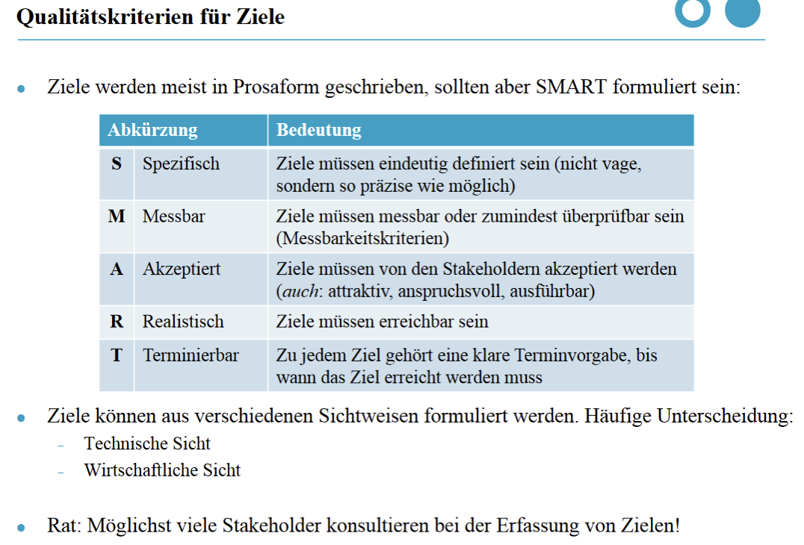

**Ziele nach SMART**

## Ziele
Unser Unternehmen "Academic Flow" bietet eine Plattform als Jobbörse für Studierende und Unternehmen. Unternehmen haben dort die Chance passende studentische Mitarbeiter zu finden und Studierende können demnach bei der Jobsuche auf Stellenanzeigen von Unternehmen eingehen. 

 

**Spezifisch:** Wir wollen eine Plattform für Studenten und Unternehmen erstellen, damit Studenten einfacher und schneller Werkstudentenjobs, Vollzeitjobs nach dem Studium oder Hilfe für die Bachelorarbeit finden können. Unternehmen sollen schneller passende Mitarbeiter finden und können über die Plattform spezifisch suchen. 

**Messbar:** Durch eine spezifische Suche und erstellbare Profile sollen Unternehmen und Studenten wesentlich schneller ein passendes Angebot finden. 

**Akzeptiert:** Die Studenten und Unternehmen müssen mit der Plattform zurechtkommen, um das Ziel, des schnellen Findens eines passenden Angebots, zu erreichen. 

**Realistisch:** Die Plattform soll erstmal die Must-Have Punkte erfüllen, natürlich könnten wir durch Nice-To-Have Punkte die ganze Plattform etwas verschönern oder aufwerten, wie zum Beispiel durch abgeben eines Feedbacks ans Unternehmen/Studenten. 

**Terminierbar:** Das Mock-Up für den ersten Entwurf sollte bis Ablauf des Probemonats (24.05.2022) stehen. Die einzelnen Aufgaben der Umsetzung sollten bis zum jeweiligen Sprint Review fertig und überarbeitet sein. 

